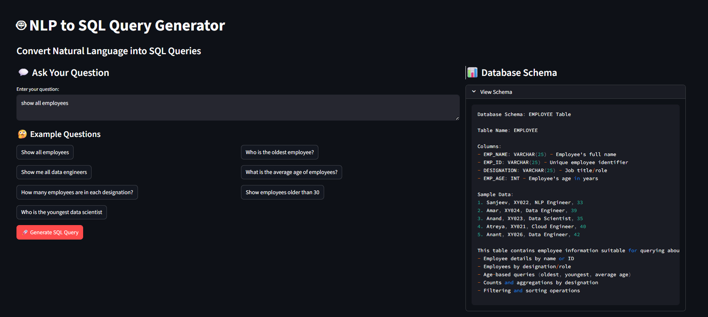
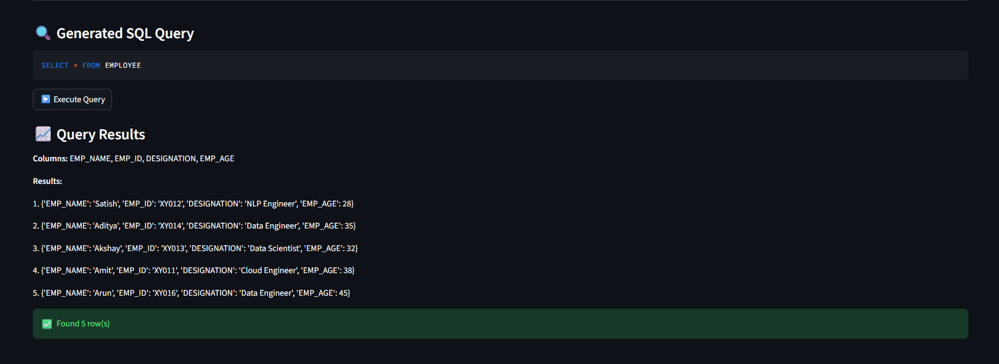

# NLP-to-SQL-query-generator
AI-powered NLP to SQL Query Generator using Python, Streamlit, Groq API, and SQLite for converting natural language into SQL queries.

# 🤖 NLP to SQL 

An AI-powered NLP to SQL Query Generator built using Python, Streamlit, Groq API, and SQLite.
The application converts natural language questions into executable SQL queries and retrieves results from the database.

---

# 🚀 Features

* Convert natural language into SQL queries
* AI-powered SQL generation using Groq LLM
* SQLite database integration
* Interactive Streamlit interface
* SQL query execution
* Safe query validation (SELECT-only queries)
* Employee database querying
* Example question suggestions

---

# 🛠️ Technologies Used

* Python
* Streamlit
* Groq API
* Llama 3.3 Model
* SQLite
* NLP
* python-dotenv

---

# 📂 Project Structure

```plaintext
nlp-to-sql-query-generator/
│
├── sql_app.py
├── sql_data_insert.py
├── employee.db
├── schema.txt
├── requirements.txt
│
└── screenshots/
    ├── main-ui.png
    └── query-results.png
```

---

# 📊 Database Schema

The application uses an `EMPLOYEE` table with the following columns:

| Column Name | Data Type   | Description   |
| ----------- | ----------- | ------------- |
| EMP_NAME    | VARCHAR(25) | Employee Name |
| EMP_ID      | VARCHAR(25) | Employee ID   |
| DESIGNATION | VARCHAR(25) | Employee Role |
| EMP_AGE     | INT         | Employee Age  |

Schema reference:

---

# ⚙️ Installation

## 1️⃣ Clone Repository

```bash
git clone https://github.com/Sahana-Surimutt/NLP-to-SQL-query-generator.git
cd NLP-to-SQL-query-generator
```

---

## 2️⃣ Create Virtual Environment (Optional)

```bash
python -m venv venv
```

Activate environment:

### Windows

```bash
venv\Scripts\activate
```

### Linux/Mac

```bash
source venv/bin/activate
```

---

## 3️⃣ Install Dependencies

```bash
pip install -r requirements.txt
```

---

## 4️⃣ Configure Environment Variables

Create a `.env` file:

```env
GROQ_API_KEY=your_groq_api_key
```

---

## 5️⃣ Run Application

```bash
streamlit run sql_app.py
```

---

# 💡 Example Queries

* Show all employees
* Who is the oldest employee?
* Show me all data engineers
* What is the average age of employees?
* Show employees older than 30
* Count employees by designation

---

# 🔄 How It Works

1. User enters a natural language query
2. Groq LLM converts it into SQL
3. SQL safety validation is performed
4. Query executes on SQLite database
5. Results are displayed in the Streamlit UI

---

# 📸 Screenshots

## Main Interface



---

## Query Results



---

# 🔐 Security Features

* Only SELECT queries allowed
* SQL safety validation implemented
* Dangerous SQL keywords blocked
* Multiple query execution prevented

---

# 🔮 Future Improvements

* Support for MySQL/PostgreSQL
* Voice input support
* Query history
* Advanced database support
* Data visualization dashboard
* Multi-table query support

---

# 📌 Use Cases

* NLP-based database interaction
* SQL learning assistant
* AI-powered querying systems
* Educational database projects
* Intelligent analytics applications

---

# 📜 License

This project is licensed under the MIT License.

---
